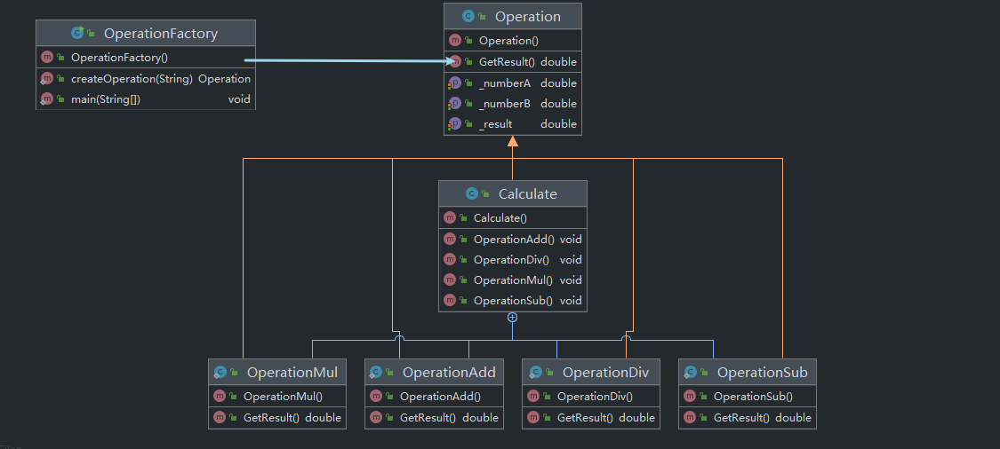

#4开放封闭原则
软件实体（类、模块、函数等）应对扩展开放，但对修改封闭

当一个需求变化导致程序中多个依赖模块都发生了级联的改动，那么这个程序就展现出了我们所说的 "坏设计（bad design）" 的特质。应用程序也相应地变得脆弱、僵化、无法预期和无法重用。开放封闭原则（Open Closed Principle）即为解决这些问题而产生，它强调的是你设计的模块应该从不改变。当需求变化时，你可以通过添加新的代码来扩展这个模块的行为，而不去更改那些已经存在的可以工作的代码。
##4.1开放封闭原则描述
符合开放封闭原则的模块都有两个主要特性：

1. 它们 "面向扩展开放（Open For Extension）"。
   
    也就是说模块的行为是能够被扩展的。当应用程序的需求变化时，我们可以使模块表现出全新的或与以往不同的行为，以满足新的需求。

2. 它们 "面向修改封闭（Closed For Modification）"。
   
    模块的源代码是不能被侵犯的，任何人都不允许修改已有源代码。

看起来上述两个特性是互相冲突的，因为通常扩展模块行为的常规方式就是修改该模块。一个不能被修改的模块通常被认为其拥有着固定的行为。那么如何使这两个相反的特性共存呢？

抽象是关键。

在使用面向对象设计技术时，可以创建固定的抽象和一组无限界的可能行为来表述。这里的抽象指的是抽象基类，而无限界的可能行为则由诸多可能衍生出的子类来表示。为了一个模块而篡改一个抽象类是有可能的，而这样的模块则可以对修改封闭，因为它依赖于一个固定的抽象。然后这个模块的行为可以通过创建抽象的衍生类来扩展。

##4.2示例：Client/Server 引用

Client 和 Server 类都是具体类（Concrete Class），所以无法保证 Server 的成员函数是虚函数。 这里 Client 类使用了 Server 类。如果我们想让 Client 对象使用一个不同的 Server 对象，那么必须修改 Client 类以使用新的 Server 类和对象。

在这个示例中，AbstractServer 类是一个抽象类，并包含一个纯虚成员函数。Client 类依赖了这个抽象，但 Client 类将使用衍生的 Server 类的对象实例。如果我们需要 Client 对象使用一个不同的 Server 类，则可以从 AbstractServer 类衍生出一个新的子类，而 Client 类则依然保持不变。

##样例代码参考此处简单工厂样例代码
