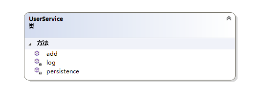
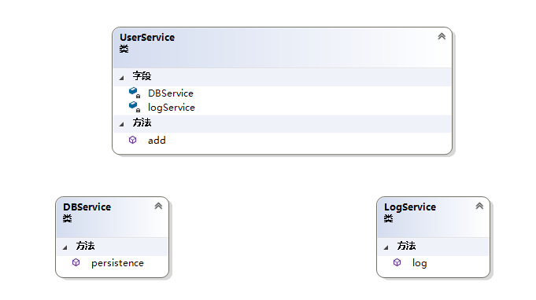
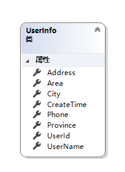
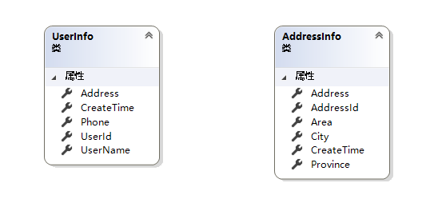
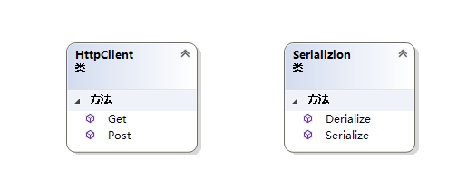

#3.单一职责(SRP)原则
##3.1什么是单一职责(SRP)原则
单一职责原则的英文是 Single Responsibility Principle，缩写为 SRP。翻译过来就是：一个类或者模块只负责完成一个职责（或者功能）。
所谓职责是指类变化的原因。如果一个类有多于一个的动机被改变，那么这个类就具有多于一个的职责。而单一职责原则就是指一个类或者模块应该有且只有一个改变的原因。
很多人认为这个原则是针对一个类进行描述，在我看来这里使用模块这个更加抽象的名词更为合适。在设计中，小到一个方法，大到一个模块我们都应该尽量取遵循单一职责原则。
##3.2为什么要遵循单一职责
相信在我们日常开发中，每个人都遇到过改了一个问题经常会引起另一个问题。其原因大多都是因为在设计上违背了单一职责原则。
如果一个类承担的职责过多，就等于把这些职责耦合在一起了。一个职责的变化可能会削弱或者抑制这个类完成其他职责的能力。这种耦合会导致脆弱的设计，当发生变化时，设计会遭受到意想不到的破坏。而如果想要避免这种现象的发生，就要尽可能的遵守单一职责原则。此原则的核心就是解耦和增强内聚性，是为了_**实现代码高内聚、低耦合，提高代码的复用性、可读性、可维护性**_.

如下图，就是一个非常明显的不满足单一职责的类。我们的业务类UserService中包含了add、log、persistence三个方法，同时也包含了三个职责业务添加、日志记录、持久化。而实际上我们的业务规则可能是经常变化的，但是我们的持久化方法和日志记录是不常变化的。由于耦合在一个类中我们频繁改动的业务方法，很有可能影响到日志记录与持久化。又或者是我们日志记录和持久化方法这与业务无关的变动也很有可能影响到我们的正常的也业务逻辑。

正确的做法是将他们分离开来。

##3.3如何判断职责是否足够单一
对于单一职责这一原则的定义和描述，相信每一个程序员都能张口就来。它理解起来也并不难，即我们不要设计大而全的类或模块，要尽量设计粒度小、功能单一的模块。但实际应用过程中确是非常困难的，也是一个非常有争议性的原则，原因就在于如何去判断职责是否足够单一。就像做菜一样，“放盐少许”，那么这个少许到底是多少？你与专业大厨的区别就在于对这个度的把握。
程序设计也是如此，上面那个例子是非常简单的一眼就能区分职责。但实际开发中往往有很多场景会让你对职责是否单一的判定难以拿捏。
如下面这个用户类是否满足单一职责呢？

我们可以看到，省市区地址信息在用户信息类里面，这种情况下你说它满足不满足似乎都有道理。这时就要根据具体的业务场景来看，如果你的业务场景中地址信息仅仅作为用户信息的一部分展示来看，这么设计就是合理的。而如果你的地址信息有一些单独的逻辑，那么就是不符合单一职责的。比如电商系统。
此时我们就要把地址信息拆分出来

再如社交系统中，也许起初地址信息只是用于用户信息的一部分来展示，但是随着业务的发展多了一些根据地址信息推荐好友等特殊的需求。那么我们就要在业务演进的过程中把类进行拆分。
综上所述,我们可以总结出

1. 不同的应用场景，对同一个类的职责是否单一的判定，是不一样的。我们需要具体场景具体分析
2. 一个类的设计可能已经满足单一职责原则了，但可能随着需求的迭代在未来的某个时候就不再满足单一职责原则了，此时我们没必要过于未雨绸缪，过度设计。可以先满足业务需求。随着业务的发展，如果类变得越来越庞大，代码越来越多，不再满足单一职责，这个时候，再把这个类持续进行重构拆分。

##3.4职责设计是否越单一越好
我们再来思考一个问题，为了满足单一职责原则，是不是把类拆得越细就越好呢？
比如我们常用与接口通信的类与序列化操作类

这时如果我们进一步把Get、 Post, Serialize,Derialize进行拆分到两个类里面，看似更好的遵循了单一职责原则，但实际上如果我们的协议格式发生改变或者序列化方式发生改变，那么就要去更改两个类的代码，如果我们漏掉了一个，后果可想而知。
##3.5不满足单一职责的坏味道
随着开发经验的积累，我们是很容易嗅到一些不满足单一职责的坏味道的

1. 类的代码行数过多
2. 类依赖的其他类过多
3. 过长的方法
4. 私有方法过多
5. 不容易给类起名字，类名中包含两个或以上的名词
##3.6小结
单一职责原则是开发中最基础，最简单，确是最难把握的一个原则，我们需要不断地学习以及大量经验的积累，才能更好的掌握它。此外没有最好的设计，只有合适的设计，我们需要结合真实的业务场景。记住：无论任何的思想与原则的最终目的是让我们的代码具有更好的可读性、可维护性、可扩展性......
