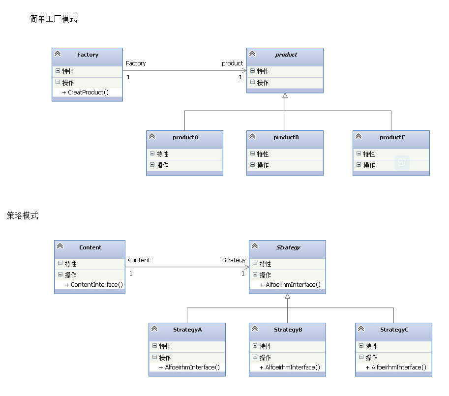

#2.策略模式
##2.1策略模式的定义和特点
    策略（Strategy）模式的定义：该模式定义了一系列算法，并将每个算法封装起来，使它们可以相互替换
    ，且算法的变化不会影响使用算法的客户。策略模式属于对象行为模式，它通过对算法进行封装，把使用算
    法的责任和算法的实现分割开来，并委派给不同的对象对这些算法进行管理。

**策略模式的主要优点如下:**
1. 多重条件语句不易维护，而使用策略模式可以避免使用多重条件语句，如 if...else 语句、switch...case 语句。
2. 策略模式提供了一系列的可供重用的算法族，恰当使用继承可以把算法族的公共代码转移到父类里面，从而避免重复的代码。
3. 策略模式可以提供相同行为的不同实现，客户可以根据不同时间或空间要求选择不同的。
4. 策略模式提供了对开闭原则的完美支持，可以在不修改原代码的情况下，灵活增加新算法。
5. 策略模式把算法的使用放到环境类中，而算法的实现移到具体策略类中，实现了二者的分离。

**其主要缺点如下:**
1. 客户端必须理解所有策略算法的区别，以便适时选择恰当的算法类。
2. 策略模式造成很多的策略类，增加维护难度。

**总结**

策略模式是对算法的封装，它把算法的责任和算法本身分割开，委派给别的对象管理。

##2.2简单工厂模式和策略模式的区别与结合
简单工厂模式和策略模式是大部分程序员，在学习设计模式时接触得最早，或在工作实践中也是用得相对比较多的两个设计模式。

    一个是创建型，另一个是行为型，然而两种不同类型的模式，在某些地方也有一丝的相似之处，同时
    在某种场景下结合使用，能起到特别好的效果。

###2.2.1简单工厂模式

    简单工厂模式是创建型模式，创建型模式顾名思义，也就是说在创建对象的时候，遇到了瓶颈才会选择的设计模式。
    那么该什么情况使用呢。
    简单工厂模式的实质是由一个工厂类根据传入的参数，动态决定应该创建并且返回哪一个产品类（这些产品类继承自
    一个父类或接口）的实例。
    那么也就是说：
    1、有已知的产品类
    2、你无法准确的知道编译哪个产品类
    3、需要在运行时决定创建哪个产品类
    4、产品类不多
    很明显看出，在创建对象上的灵活性高，但是工厂类只能创建可能会使用到的产品类，假如新添了产品类就得修改工
    厂类，这样就会违反开闭原则。
###2.2.2策略模式

    策略模式是行为型模式，它定义了一系列的算法，并将每一个算法封装起来，而且使它们还可以相互替换。策略模式
    让算法独立于使用它的客户而独立变化。
    在一段代码里，使用了逻辑控制（if-else,swich-case）来决定算法，算法有相似的方法和函数，就可以选择策略模式。
    那么也就是说：
    1、某方法里有多个条件语句，条件语句代码块里有许多行为过程。
    2、其算法能封装到策略类
    2、算法随意切换
    3、算法与客户端隔离
    这样一来，通过选择对应的策略类，作为参数传到Content类里，在运行时配置对应的算法。
###2.2.3区别总结
    
    从上面的描述总结出，在运行时，两者都是通过传入参数进行配置，简单工厂模式则是选择创建出需要的对象，而策略模式
    则是配置出需要的行为算法。一个是对象创建，另一个是行为算法的替换。

###2.2.4结合
   下面有一段策略模式的代码。
```
using System;
using System.Net.Configuration;

namespace StrategyWithFactory
{
    class Program
    {
        static void Main(string[] args)
        {
            Strategy strategyContent = null;

            //伪代码。获取输入算法类型
            EStrategy inputType = RequestInput();

            if (inputType == EStrategy.A)
            {
                new Content(new StrategyA()).ContentInterface();
            }
            else if (inputType == EStrategy.B)
            {
                new Content(new StrategyB()).ContentInterface();
            }
            else if (inputType == EStrategy.C)
            {
                new Content(new StrategyC()).ContentInterface();
            }
        }
    }

    //算法抽象类
    abstract class Strategy
    {
        public abstract void AlfoeirhmInterface();
    }

    //A算法类
    class StrategyA : Strategy
    {
        public override void AlfoeirhmInterface()
        {
            Console.WriteLine("this is the StrategyA");
        }
    }

    //B算法类
    class StrategyB : Strategy
    {
        public override void AlfoeirhmInterface()
        {
            Console.WriteLine("this is the StrategyB");
        }
    }

    //B算法类
    class StrategyC : Strategy
    {
        public override void AlfoeirhmInterface()
        {
            Console.WriteLine("this is the StrategyC");
        }
    }

    //上下文类
    class Content
    {
        private readonly Strategy _strategy;
        public Content(Strategy strategy)
        {
            _strategy = strategy;
        }

        public void ContentInterface()
        {
            _strategy.AlfoeirhmInterface();
        }
    }

    //算法枚举
    enum EStrategy
    {
        A = 1,
        B = 2,
        C = 3
    }
}
```
上面的代码是策略模式的原型，假如Main函数是客户端，那么以后每加一个算法，都得在客户端修改一次，添加一个else if，引起了不必要的麻烦。那么，现在的情况，首先我们知道已有的ABC三种算法，但是我们又不确定运行时使用哪种算法，同时为了让客户端和业务逻辑代码隔离开，于是，我们可以将客户端的创建算法类的业务逻辑转移到Cotent类，并添加一个创建算法工厂的方法。
```
using System;

namespace StrategyWithFactory
{
    class Program
    {
        static void Main(string[] args)
        {
            //伪代码。获取输入算法类型
            EStrategy inputType = RequestInput();
            new Content(inputType).ContentInterface();
        }
    }

    //上下文类
    class Content
    {
        private readonly Strategy _strategy;
        public Content(EStrategy eStrategy)
        {
            _strategy = CreateFactory(eStrategy);
        }

        public Strategy CreateFactory(EStrategy eStrategy)
        {
            Strategy strategy = null;
            switch (eStrategy)
            {
                case EStrategy.A:
                    strategy = new StrategyA();
                    break;

                case EStrategy.B:
                    strategy = new StrategyB();
                    break;

                case EStrategy.C:
                    strategy = new StrategyC();
                    break;
            }
            return strategy;
        }

        public void ContentInterface()
        {
            _strategy.AlfoeirhmInterface();
        }
    }
}
```
那么，策略和简单工厂的结合应用就实现了。