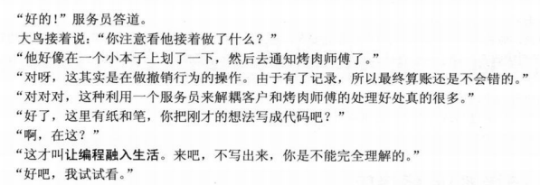

#6.命令模式
    将一个请求封装为一个对象，从而使你可用不同的请求对客户端进行参数化;对请求排队或记录请求日志，
    以及支持可撤销的操作
#6.1故事




#6.2.1紧耦合设计


```java
//烤羊肉串者
public class Barbecuer {
    public void BakeMutton() {
        System.out.println("烤羊肉串!");
    }
    public void BakeChickenWing(){
        System.out.println("烤鸡翅!");
    }
}
```
```java
//客户端调用
public class Main {
    public static void main(String[] args) {
        Barbecuer boy = new Barbecuer();

        boy.BakeMutton();
        boy.BakeChickenWing();
        boy.BakeMutton();
    }
}
```
##6.2.1松耦合后


```java
class BackChickenWingCommand extends Command{

    public BackChickenWingCommand(Barbecuer receiver) {
        super(receiver);
    }

    @Override
    public void ExcuteCommand() {
        receiver.BakeChickenWing();
    }
}

```
```java
package CommandPattern.LooselyDesign;

import CommandPattern.Barbecuer;

/**
 * @Author: zcc
 * @Created_on: 2022/3/8/18:43
 * ./BackMuttonCommand.
 */
class BackMuttonCommand extends Command {
    public BackMuttonCommand(Barbecuer receiver) {
        super(receiver);
    }

    @Override
    public void ExcuteCommand() {
        receiver.BakeMutton();
    }
}

```
```java
package CommandPattern.LooselyDesign;

import CommandPattern.Barbecuer;

/**
 * @Author: zcc
 * @Created_on: 2022/3/8/18:38
 * ./Command.java
 */
//抽象命令类
public abstract class Command {
    protected Barbecuer receiver;

    public Command(Barbecuer receiver){
        this.receiver=receiver;
    }
    abstract public void ExcuteCommand();
}

```
```java
package CommandPattern.LooselyDesign;
import java.util.LinkedList;
import java.util.List;

import static com.sun.org.apache.xalan.internal.lib.ExsltDatetime.time;

/**
 * @Author: zcc
 * @Created_on: 2022/3/8/18:47
 * ./Waiter.java
 */
public class Waiter {
    private List<Command> orders = new LinkedList<>();

    //设置订单
    public void setOrders(Command command) {
        if(command.toString().equals("命令模式.BakeChickenWingCommand")){
            System.out.println("服务员:鸡翅没有了，请点别的烧烤");
        }
        else{
            orders.add(command);
            System.out.println("增加订单:"+command.toString()+" 时间:"+time());
        }
    }
    //取消订单
    public void CancelOrders(Command command){
        orders.remove(command);
        System.out.println("取消订单: "+command.toString()+" 时间: "+time());
    }
    //通知全部执行
    public void Notify(){
        for (Command command:orders) {
            command.ExcuteCommand();
        }
    }
}

```
```java
package CommandPattern.LooselyDesign;

import CommandPattern.Barbecuer;

/**
 * @Author: zcc
 * @Created_on: 2022/3/8/19:37
 * ./Main.java
 */
//客户端
public class Main {
    public static void main(String[] args) {
        //准备
        Barbecuer boy = new Barbecuer();
        Command backMuttonCommand1 = new BackMuttonCommand(boy);
        Command backMuttonCommand2 = new BackMuttonCommand(boy);
        Command backChickenWingCommand1 = new BackChickenWingCommand(boy);
        Waiter waiter = new Waiter();

        //点菜
        waiter.setOrders(backMuttonCommand1);
        waiter.setOrders(backMuttonCommand2);
        waiter.setOrders(backChickenWingCommand1);
        //做
        waiter.Notify();
    }
}

```


