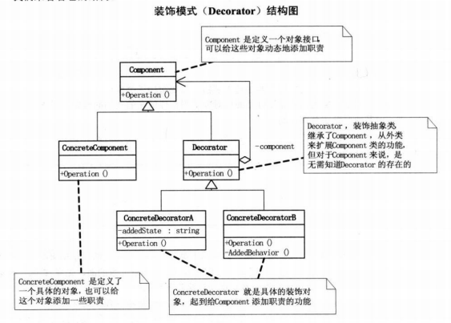

#7.装饰模式(Decorator)
        动态地给一个对象添加一些额外的职责，就增加功能来说，装饰模式比生成子类更为灵活



Component是定义一个对象接口,可以给这些对象动态的增加职责。ConcreteComponent是定义的一个具体的对象，也可以给这个对象添加一些职责。
Decorator，装饰抽象类，继承了 Component 。从外类来扩展 Component 类的功能，但对于 Component 来说，是无需知道 Decorator的存在的。
至于ConcreteDecorator就是具体的装饰对象，起到给 Component 添加职责的功能。
```java
package DecoratorPattern;

/**
 * @Author: zcc
 * @Created_on: 2022/3/16/13:18
 * ./Component.java
 */
abstract class Component {
    public abstract void Operation();
}
```
```java
package DecoratorPattern;

/**
 * @Author: zcc
 * @Created_on: 2022/3/16/13:19
 * ./ConcreteComponent.java
 */
public class ConcreteComponent extends Component {
    @Override
    public void Operation() {
        System.out.println("具体操作对象");
    }
}
```
```java
package DecoratorPattern;

/**
 * @Author: zcc
 * @Created_on: 2022/3/16/13:20
 * ./Decorative.java
 */
public class Decorator extends Component{
    protected Component component;
    public void setComponent(Component component){
        this.component=component;
    }
    @Override
    public void Operation() {
        if(component!=null){
            component.Operation();
        }
    }
}
```
```java
//具体实现类A
package DecoratorPattern;
/**
 * @Author: zcc
 * @Created_on: 2022/3/16/13:23
 * ./ConcreteDecoratorA.java
 */
public class ConcreteDecoratorA extends Decorator{
    private String addedState;

    @Override
    public void Operation() {
        super.Operation();
        addedState="New State";
        System.out.println("具体装饰对象A的操作");
    }
}
```
```java
//具体实现类B
package DecoratorPattern;
/**
 * @Author: zcc
 * @Created_on: 2022/3/16/13:26
 * ./ConcreteDecoratorB.java
 */
public class ConcreteDecoratorB extends Decorator{
    @Override
    public void Operation() {
        super.Operation();
        AddedBehavior();
        System.out.println("具体装饰对象B的操作");
    }
    private void AddedBehavior(){

    }
}

```
```java
//客户端代码
package DecoratorPattern;

/**
 * @Author: zcc
 * @Created_on: 2022/3/16/13:29
 * ./Main.java
 */
public class Main {
    public static void main(String[] args) {
        ConcreteComponent c=new ConcreteComponent();
        ConcreteDecoratorA d1 =new ConcreteDecoratorA();
        ConcreteDecoratorB d2 =new ConcreteDecoratorB();

        d1.setComponent(c);
        d2.setComponent(d1);
        d2.Operation();
    }
}

```
##7.1
       装饰模式是利用 SetCompontent 来对对象进行包装的。每个装饰对象的实现就和如何使用这个对象分开了，
    每个装饰对象 只关心自己的功能，不需要关系如何被添加到对象链当中。
       如果只有一个 ConcreteCompontent 类而没有抽象的 Compontent 类，那么 Decorator 类可以是 
    ConcreteCompontent的一个子类。同样的道理，如果只有一个 ConcreteCompontent 类那么就没有必要
    建立一个独立的 Decorator 类，而可以把 Decorator 和 ConcreteDecorator 的责任合并成一个类。