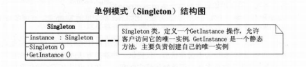

#8.单例模式(Singleton)
    保证一个类仅有一个实例，并提供一个访问它的全局访问点
通常我们可以让一个全局变量使得一个对象被访问，但它不能防止你实例化多个对象。一个最好的办法就是，
让类自身负责保存它唯一的实例 。这个类可以保证没有其他实例可以被创建，并且他可以提供一个访问该实例的方法。



```java
package SingletonPattern;

/**
 * @Author: zcc
 * @Created_on: 2022/3/16/17:45
 * ./Singleton.java
 */
public class SingletonA {
    private static SingletonA instance;
    private SingletonA(){//使构造方法私有，堵死了外界使用new创建该类实例的可能
    }
    public static SingletonA getInstance(){//此方法是获得本类实例的唯一全局访问点
        if(instance==null){//若实例不存在，则new 一个新实例，否则返回已有的实例
            instance = new SingletonA();
        }
        return  instance;
    }
}

```
##8.2多线程时的单例
```java
package SingletonPattern;

import java.util.concurrent.locks.Lock;
import java.util.concurrent.locks.ReentrantLock;

/**
 * @Author: zcc
 * @Created_on: 2022/3/16/18:09
 * ./SingletonB.java
 */
public class SingletonB {
    private static SingletonB instance;
    private static final Object syncRoot= new Object();
    private SingletonB(){

    }
    public static SingletonB getInstance(){
        if(instance==null){
            Lock lock = new ReentrantLock();
            lock.lock();
            try {
                if(instance==null)
                    instance=new SingletonB();
            }finally {
                lock.unlock();
            }
        }
        return instance;
    }
}

```